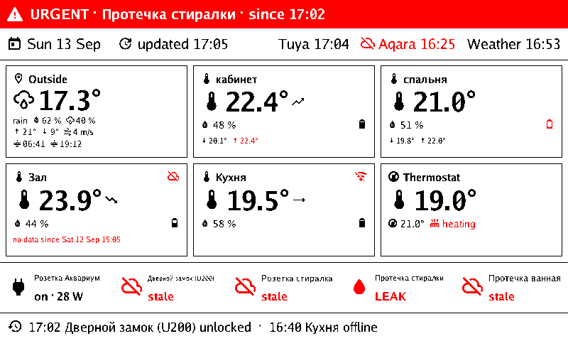

# domovoi

[](https://github.com/mshaulsky/domovoi/actions/workflows/ci.yml)
[](https://goreportcard.com/report/github.com/mshaulsky/domovoi)
[](LICENSE)

A quiet dashboard for the home: one Go binary on a Raspberry Pi Zero 2W
polls the smart-home clouds, remembers what it saw, and paints the state of
the house onto a 7.5" three-colour e-ink panel. Named after the domovoi, the
house spirit that keeps an eye on the household and grumbles when something
is wrong.



## What it shows

The overview scene fits a whole flat onto one 800 × 480 frame:

- **The header** — the date, when the frame was drawn, and how fresh each
  source is. A source that stopped answering is crossed out and turns red.
- **Outside** — temperature, sky, humidity, chance of rain, today's high and
  low, wind, sunrise and sunset, from Open-Meteo.
- **A tile per room** — temperature and humidity, an arrow for the last
  hour's trend, today's lowest and highest, the battery of the sensor. A
  thermostat shows its setpoint and whether it is heating. A room that has
  been silent for hours says so instead of pretending.
- **The hallway strip** — the small things: outlets with their power draw,
  leak sensors, the door lock.
- **The alert banner and the event line** — a leak, an open door, a sensor
  gone quiet, with the time it happened.

Everything the dashboard says in its own voice comes from a localisation
catalogue and follows the configured `language`; devices and rooms appear
under the names they carry in your account, whatever language those are in.

## Where it stands

**Stage 2 is done.** The assembly, three sources (Tuya cloud, Aqara, Open-Meteo
weather), history in SQLite — the state survives a restart, the tiles carry
today's extremes and hourly trends, events are journalled — and the overview
scene rendered to a PNG. It runs on a PC against real devices.

Next: the e-ink backend and its refresh policy, a liveness check behind the
systemd watchdog, then alerts with Telegram, a small web back office, and
local Zigbee through MQTT. The design behind every decision is in
[DESIGN.md](DESIGN.md).

## Try it on a PC

You need Go 1.25 and the credentials of the clouds you want to read.

```sh
cp domovoi.env.example .env                  # fill in the credentials
cp configs/domovoi.example.yaml domovoi.yaml # coordinates, timezone, intervals
. .env && go run ./cmd/domovoi -config domovoi.yaml -check   # validate, touch nothing
. .env && go run ./cmd/domovoi -config domovoi.yaml -once    # poll once, draw frame.png
. .env && go run ./cmd/domovoi -config domovoi.yaml          # keep going; Ctrl-C to stop
```

`-once` leaves `frame.png` and `domovoi.db` in the working directory; every
later run picks the history up from there. Flags: `-config`, `-check`,
`-once`, `-verbose`, `-version`.

What each source needs:

- **Tuya** — a project on the Tuya IoT platform with your devices linked to
  it: the access ID and key, and the data centre (`eu`, `us`, `cn`, `in`).
- **Aqara** — an ordinary Aqara Home account. domovoi signs in to Aqara's
  agent service by itself, because the keys that service hands out expire
  after days. Give it the MD5 of the password (`printf %s "$password" |
  md5sum`), never the password, and preferably a second account that you
  share your home with as a family member — revoking it is then one tap in
  the app.
- **Weather** — nothing but the coordinates of the house.

## Configuration

One YAML file, [`configs/domovoi.example.yaml`](configs/domovoi.example.yaml)
is a complete, commented example. In short:

- `timezone` and `language` for the whole screen; a display may override
  the language.
- `sources` — one entry per cloud, each with its `interval`; the `name`
  becomes the prefix of every device ID, so once set it stays.
- `storage` — where the SQLite file lives, how long readings and events are
  kept (90 days), how often an unchanged value still gets a row (hourly).
- `displays` — for now `pngfile`: the file, the size, monochrome or
  three-colour, the scenes to show, the render `tick` and how often an
  unchanged frame is redrawn anyway.

Secrets are never written into the YAML. A `${NAME}` placeholder is resolved
from the file `$CREDENTIALS_DIRECTORY/NAME` (systemd's `LoadCredential=`),
then `/run/secrets/NAME` (Docker), then the environment variable — the same
file works on the PC and on the Pi.

## On the Raspberry Pi

```sh
make release          # domovoi-arm64: static, no cgo, ~16 MB
```

[`deploy/systemd/domovoi.service`](deploy/systemd/domovoi.service) carries
the whole recipe in its header: a `domovoi` user in the `spi` and `gpio`
groups, the credentials as root-only files under `/etc/credstore`, the
config in `/etc/domovoi.yaml`, a `-check` before the first start. The unit is
`Type=notify`: the binary reports when it is ready and feeds the watchdog
itself, and systemd restarts it if it ever stops. State lives in
`/var/lib/domovoi`.

Until the e-ink backend lands, the Pi draws the same PNG a PC does.

## How it works

Every source is polled on its own schedule and hands the core a batch:
the devices it knows and their current readings. The core merges the batch
into the state of the home, turns transitions into events (a door opened,
a sensor went quiet, a leak), writes changes and hourly heartbeats to SQLite
in one transaction, and wakes the render coordinators. Each display has a
coordinator that redraws on its tick — or at once when something worth a
frame changed — enriching the snapshot with today's extremes and trends
from the database. After a restart the state is restored from the file, so
the first frame is the last known picture rather than a blank one.

The code follows that shape:

- `cmd/domovoi` — flags and signals, nothing else.
- `internal/application` — the modules and their lifecycle, `Run`;
  `application/modules` is the only glue between the YAML, the container
  and the domain packages.
- `internal/container` — lazy singletons and kind registries.
- `internal/model` — devices, readings, events and the metric catalogue.
- `internal/source` — the source contract and the poller; `tuya`, `aqara`
  and `weather` are the adapters.
- `internal/state` — what is true now, per-source health, event
  classification.
- `internal/core` — the loop: batches in, persistence, frames out.
- `internal/storage` — `sqlite` opens and migrates the file; one repository
  per table; `store` is the unit of work.
- `internal/render`, `internal/scene`, `internal/icon`, `internal/i18n` —
  the coordinator, the widgets and layout, the pictograms, the catalogues.
- `internal/display` — the display contract and the `pngfile` backend.
- `internal/config`, `internal/metrics` — the file with its secrets,
  Prometheus counters for the HTTP server to come.

## Developing

```sh
make test              # unit tests, race detector
make test-integration  # plus the tests that touch files and sockets
make lint              # golangci-lint at the pinned version
make generate          # mocks from every interfaces.go
make check             # what CI runs: lint, both test suites, an arm64 build
make icons             # regenerate the icon font subset (needs node + subset-font)
```

Scenes are tested against golden images in `internal/scene/testdata`; after
an intended visual change run `go test ./internal/scene -update` and look at
the PNGs. The conventions the code follows — package boundaries, tests,
style — are written down for coding agents in [AGENTS.md](AGENTS.md); they
apply to people just the same.

## Built on

The clouds are read through two small libraries of the same author,
[tuyacloud](https://github.com/mshaulsky/tuyacloud) and
[aqaramcp](https://github.com/mshaulsky/aqaramcp). Inside: `modernc.org/sqlite`
and `goose` for the history, `prometheus/client_golang` for the counters,
`nicksnyder/go-i18n` for the words, `coreos/go-systemd` for the notify
socket, `golang.org/x/image` for the drawing. Pure Go throughout, so the
Pi binary is cross-compiled from anywhere.

## Licence

MIT. The icon font subset is derived from
[Material Design Icons](https://pictogrammers.com/library/mdi/) (Apache 2.0,
see `internal/icon/LICENSE-MDI`); the text faces are the Go fonts.
